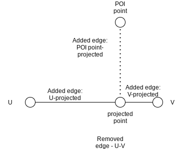
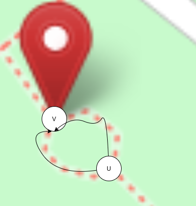
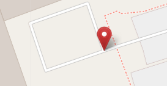
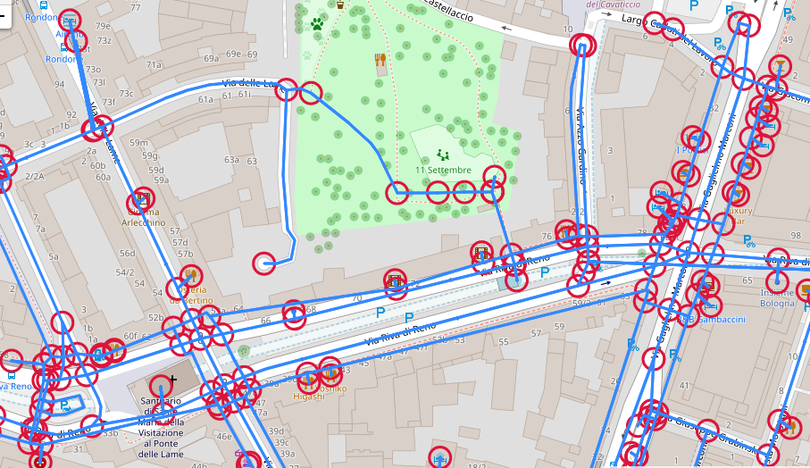

# OSM-based Graph

For each region we construct an OSM-based graph. 

To construct the graph we first extract OSM points of interest (POI) and streets from the OSM API. OSM entities include various tags with a key and a value pair (e.g, key=name and value=Empire State Building). The POI extracted must include one or more of the following tag keys: name, shop, brand, tourism, amenity, wikipedia, wikidata. 

Second, we then project the POI on the streets extracted. For each POI a node is added with a tag name 'poi'. In addition if the projected point splits the edge it is projected on then an additional node is added with tage name 'projected-poi'. An edge added between the two nodes (POI and the projected\end of edge) with tage name 'poi'. 

\

\
*Example of POI projection on edge.*\

 Thus, the edges are the street and the nodes are elements of the street (e.g, intersection), a projected POI, or POI. The POI are only connected to the streets and not among themself. A POI can be one of the following geometries: point, line, polygon. The POI is connected to the closest streets. If it is a point geometry it can be only connected to one street - the closest one. If it is a line or a polygon then different parts of the geometry can be close to different streets and therefore it can be connected to multiple streets (up to 4 streets).  

The graph we construct is a directional graph with multiple edges between two nodes. Multiple edges might occur in cases where there are two paths between nodes or in case of a loop. It is also a weighted graph where the weight is the actual distance between the nodes in meters. 
The edges also have tags, e.g., key=highway and value=residential.

\

\
*Example of case where there are parallel paths between two nodes (U and V).*\

\
*Example of case where there is a loop in the graph.*\

\
*Example of graph.*

